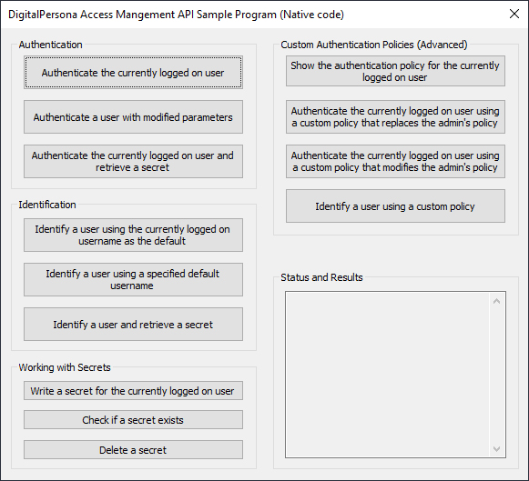
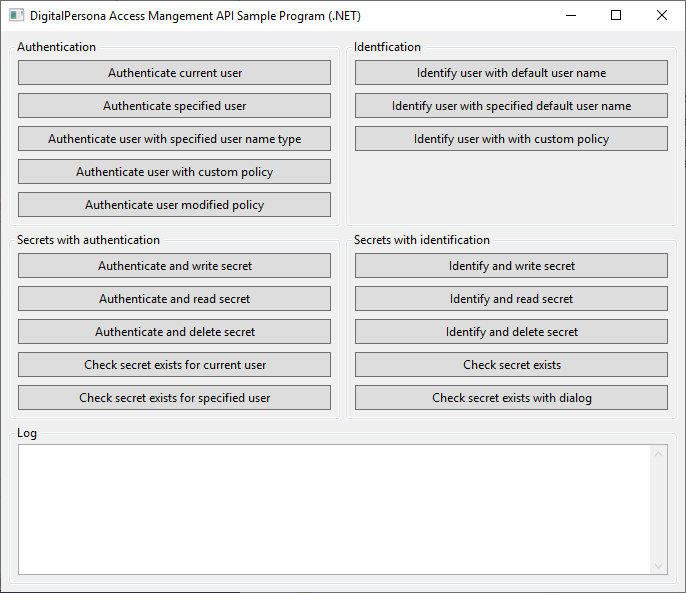
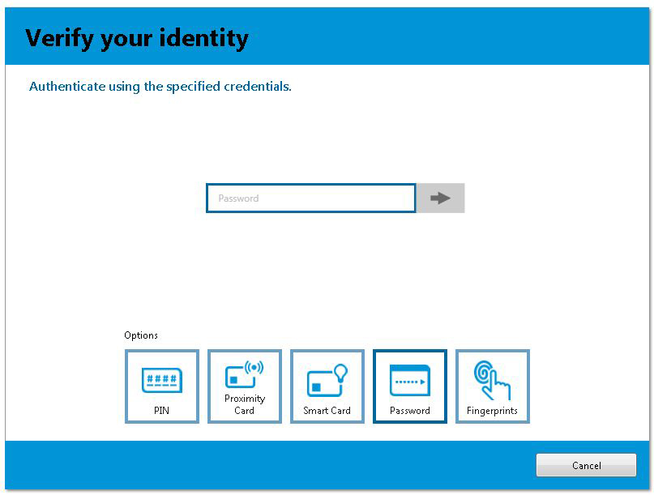



## Native API Sample Applications
There are three sets of Native API sample code. One each for C++, .NET and the web.

The sample application source code and the Visual Studio 2012 project files for the sample applications are provided in the following repositories.

- [digitalpersona-sample-cpp](https://github.com/hidglobal/digitalpersona-sample-cpp)  
- [digitalpersona-sample-dotnet](https://github.com/hidglobal/digitalpersona-sample-dotnet)
- [digitalpersona-sample-web](https://github.com/hidglobal/digitalpersona-sample-web)

The sample applications display a set of buttons that demonstrate a variety of tasks that you might perform with the DigitalPersona API, such as Authentication, Identification, Working with Secrets and Custom Authentication Policies.  

When you run the C++ or .NET sample applications, the main screen looks like one of the images below. For details on the web sample application, click [here](https://hidglobal.github.io/digitalpersona-sample-web).  

The source code header file, [DPAuthSdkApi.h](https://github.com/hidglobal/digitalpersona-sample-cpp/blob/master/Solution%20Items/DPAuthSdkApi.h), includes detailed comments describing what each button does.

  

C++ Sample UI

.NET Sample UI
  

Note that to run the sample application you must have a DigitalPersona client installed.

For example, to authenticate a user, click on the *Authenticate the currently logged on user* button. A standard DigitalPersona dialog box will appear, similar to the one shown below.

The actual dialog box will vary depending on your environment and the DigitalPersona client that you have installed.
You can authenticate with any method that you have set up. After you authenticate, the result of the operation will appear in the main screen of the sample program as shown below, in this case the message Authentication Succeeded as shown below.

