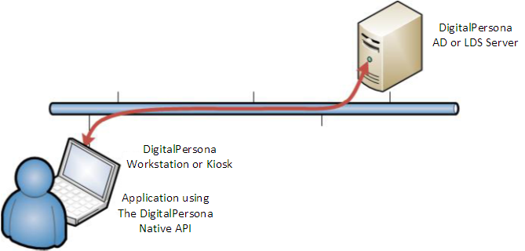

# Overview  

The DigitalPersona Native API (previously DP AUTH API) is a subset of the DigitalPersona Access Management API that provides native enrollment, authentication and identification on the Windows Platform and the web.  

User enrollment can be performed through a DigitalPersona client such as the DigitalPersona Workstation or Kiosk, Attended Enrollment or Web Enrollment. A sample application is also included illustrating use of the API in building your own web-based client.

This API is automatically installed as part of these DigitalPersona clients.

* DigitalPersona AD Workstation or LDS Workstation  
* DigitalPersona AD Kiosk or LDS Kiosk  

Sample applications and code illustrating various functions available through the API are included for [C++](https://hidglobal.github.io/digitalpersona-sample-cpp//) and [.NET](https://hidglobal.github.io/digitalpersona-sample.dotnet/) and the [web](https://hidglobal.github.io/digitalpersona-sample.web/) (through the RESTful protocol).

For detailed instructions on installing and configuring the DigitalPersona environment, see the [DigitalPersona Administrator and Client Guides](https://www.crossmatch.com/company/support/documentation/).

When you install a DigitalPersona Workstation or Kiosk client, the DigitalPersona Native API runtime is installed as well. As shown in the diagram below, your application must be installed on workstations that are also running one of the DigitalPersona clients.

The API can be used for the following:

* Authenticating users with the authentication policy and user interface used by DigitalPersona Workstation/Kiosk and optionally reading a user secret.

  The DPAlAuthenticate function displays the multi-factor authentication dialog and matches the supplied credentials against the user's enrolled credentials. The customizable dialog box accepts the credentials required by the authentication policy set by the DigitalPersona administrator. On successful authentication, DPAlAuthenticate can optionally return user secrets to the application.

* Identifying users by searching in the DigitalPersona database to find the user and authenticate them.

* The DPAlIdentAuthenticate function displays the multi-factor identification dialog and identifies the user based on the credentials supplied.

  The customizable dialog box allows the user to provide the credentials required by the current authentication policy. If the identification succeeds, DPAlIdentAuthenticate can optionally return the user name and secret to the application.

* Retrieving and saving user secrets. Secrets are cryptographically protected and are released to an application only after successful authentication of the user. Secrets are stored in the DigitalPersona database and roam with the rest of the user data.

* Implementing custom authentication policies which extend the DigitalPersona administrator’s policies or create new policies.

The DigitalPersona Native API observes all of the settings in the DigitalPersona software regarding its communications with the server, supported credentials, policies, etc.

For advanced users, your application can require additional credentials (i.e., you can create a custom authentication policy), but if secret release is required, your application’s must meet the requirements of the policy set by the DigitalPersona administrator.

# Target Audience  

This API is for developers who have a working knowledge of the C++ programming language. In addition, readers should have an understanding of the DigitalPersona product and its authentication terminology and concepts.

# Related Topics  

[Installation](docs/installation.html)  
[Typical Workflow](docs/typical-workflow.md)  
[Native API functions](docs/functions.md)  
[Sample Applications](docs/sample-applications.md)  
[Custom Authentication Policies](docs/custom-auth-policies.md)
